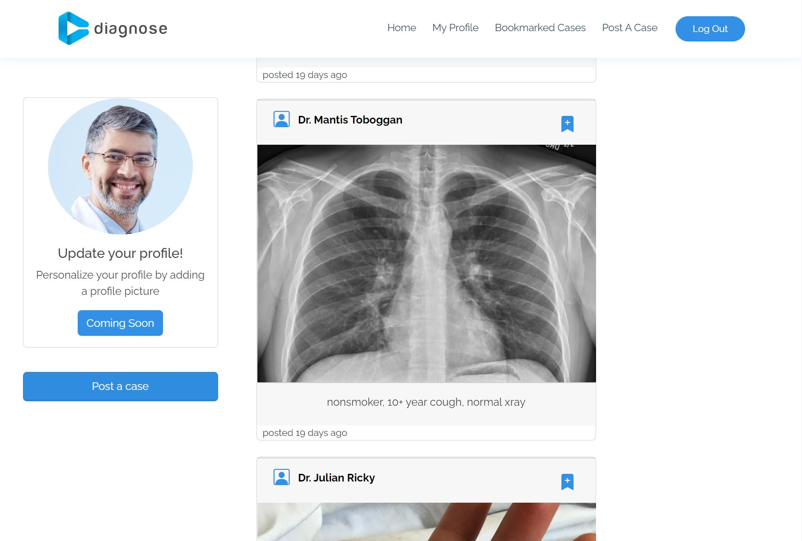

 

     

 

[Diagnose](https://diagnose.up.railway.app/) is a full-stack application built using Express.js as a backend framework, MongoDB as a database, Node.js as a backend JavaScript runtime environment, and EJS as a template language to generate HTML markup. 

The web application is meant for medical experts to share images of particular cases they would like to initiate discussions on with other medical experts. The website can be described in three simple steps:
  1. Create an account. 
  2. Post an image of your case with detailed description.
  3. Join the discussion by commenting.

Currently, other features included in this application include deletion of posts, liking posts, bookmarking posts, and visiting user profiles. 

**Link to project:** https://diagnose.up.railway.app/

     

## Install

`npm install`

---

### Things to add

- Create a `.env` file in config folder and add the following as `key = value`
  - PORT = 2121 (can be any port example: 3000)
  - DB_STRING = `your database URI`
  - CLOUD_NAME = `your cloudinary cloud name`
  - API_KEY = `your cloudinary api key`
  - API_SECRET = `your cloudinary api secret`

---

### Run

`npm start`

## Optimizations
*(optional)*

You don't have to include this section but interviewers *love* that you can not only deliver a final product that looks great but also functions efficiently. Did you write something then refactor it later and the result was 5x faster than the original implementation? Did you cache your assets? Things that you write in this section are **GREAT** to bring up in interviews and you can use this section as reference when studying for technical interviews!

## Lessons Learned:

No matter what your experience level, being an engineer means continuously learning. Every time you build something you always have those *whoa this is awesome* or *fuck yeah I did it!* moments. This is where you should share those moments! Recruiters and interviewers love to see that you're self-aware and passionate about growing.